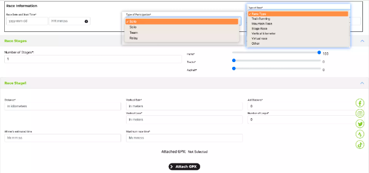
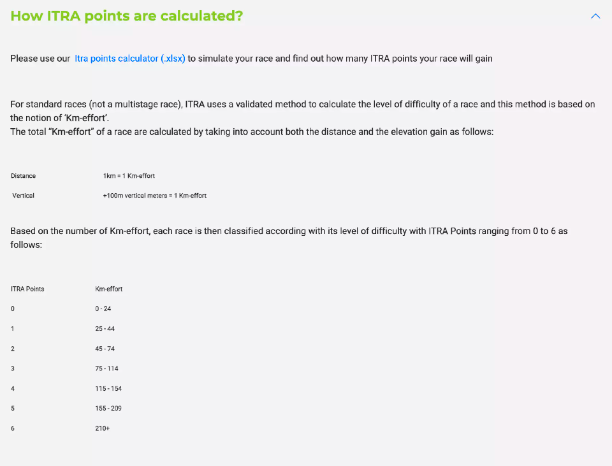
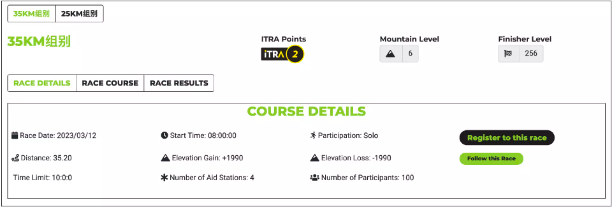
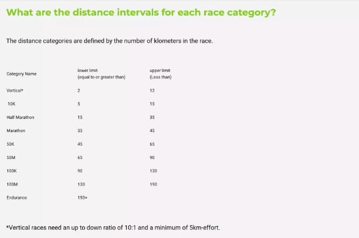
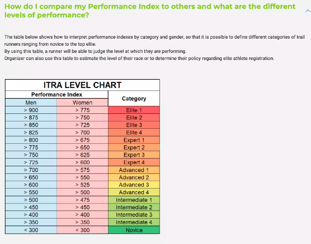

# 一、计算ITRA积分0-6

## 1、输入
下图为组委会的赛事信息上传截图

> 个人认为有效参数为：

- 参赛人数（Maximum number of participants）
- 圈数（number of loops）
- 距离（distance）
- 爬升（vertical Gain）
- 下降（vertical Loss）
- 补给站（aid stations）
- 完赛时长（Maxinum race time）
- ITRA积分 （计算公式如下：）

## 2、输出  mountain 和 finisher level

### 1）mountain level
这里还会计算一个值，就是mountain Level
已知条件也是上面的哪些参数

### 2）finisher level
通过以上所有参数（包括 mountain Level），可以得出一个 Finisher Level 的分数
这个分数是在指定时间内最长完赛的表现分数
例如：25KM的一场比赛，需要5小时内完赛，上午8:00开赛，则13:00为 Finisher Level，在13:00之前会一直在这个分数增加，13:00之后则为DNF

> 这里我抓取了2023-2018年中国组委会申请的赛事积分，请参考数据源如下： 
[2018-2023 ITRA 中国赛事数据.xlsx](2018-2023%20ITRA%20%E4%B8%AD%E5%9B%BD%E8%B5%9B%E4%BA%8B%E6%95%B0%E6%8D%AE.xlsx)

# 二、计算ITRA表现分0-999

> 下图为表示：  
1、男女的表现分数不同  
2、取值范围，目前是从100~999的取值范围，作为表现分

 
 

## 1、如何计算表现分（目标：本次计算公式）

### 1）前置参数，从 Finisher Level 开始计算

> 如上图所示，这里是所有已知条件（我认为有效参数如下）
- Participation：参数方式 Solo 个人
- Distance：距离（KM）
- Elevation Gain：总爬升
- Elevation Loss：总下降
- Time Limit：关门时间（总时长）
- Number of Aid Stations：补给站
- Number Of participants：参与人数
- Itra Point：积分（0-6）
- Mountain Level：山地等级
- Finisher Level：256 （这个很重要！！！）

Finisher Level：
解释一下Finisher Level：它是在 Time Limit 下卡点完赛所得积分，即：8:00开始比赛，关门时间2小时，即10:00此刻完赛，所得的表现分为Finisher Level，在此之前的完赛都会在Finisher Level之上加分（即：不低于Finisher Level分数）

### 2）成绩单上传，得出每个人表现分
然后组委会会上传一份选手的成绩单，主要的数据如下：

