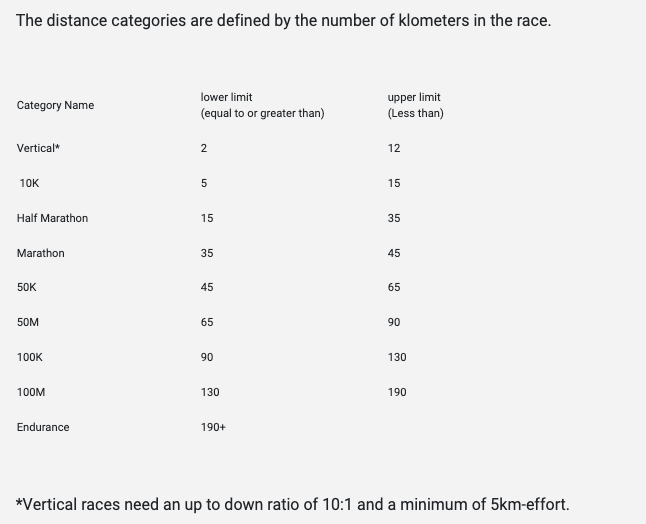
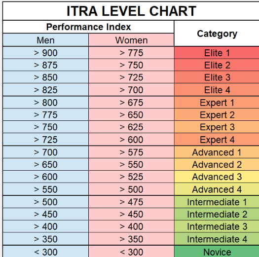
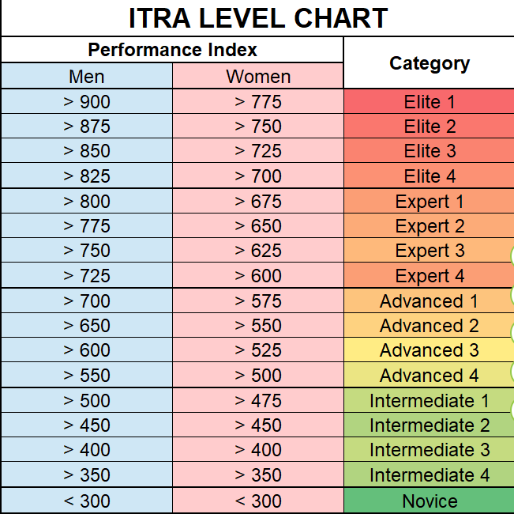

# 官方说明 ITRA Perfoemance Index
> https://itra.run/FAQ/PerformanceIndex

## 一、Vocabulary

ITRA Score - A “Score” is given to each runner for every race they complete. Each person’s runner file profile consists of many different scores, corresponding to each race they have completed.
ITRA Performance Index – the individual scores of each runner are used to calculate their Performance Index. The performance index changes with the addition of new results and over time as races become older.
ITRA Points – These points are awarded for finishing a race (1 – 6 points), each person who finishes the race receives the same number of points. This article does not discuss ITRA points, it describes only the ITRA Performance Index.

## 二、什么是 ITRA PI？
> What is the ITRA Performance Index ?

The ITRA Performance Index is a tool for ranking athletes based on their performance level. 
The performance index can be used to compare the level of different trail runners around the world and is built on a scale up to a maximum of 1000 points. 
The top of the scale corresponds to the theoretical best possible performance.

译文：（来自ChatGPT3.5）
ITRA（国际越野跑协会）表现指数是一种基于运动员表现水平进行排名的工具。
表现指数可用于比较世界各地不同越野跑者的水平，其刻度最高可达1000分。
刻度的顶部对应于理论上最佳可能的表现。

## 三、如何计算历史的表现分？

>How is the performance index calculated and over what period

The ITRA Performance Index is calculated by obtaining the weighted mean of up to the 5 best scores achieved by a runner over the previous 36 months (for the general index or the index by category).

A weighted mean is used because we give more importance to the most recent results compared with older ones and we also give more importance to a runner’s best result, then to their second best, down to their 5 best ones.

Runners who do not have 5 results will still have a PI, which is calculated using their available results, but a runner with at least 5 results will have an advantage over someone with less results.

This period of 36 months is long enough to permit reliable statistical calculations and allow an injured runner to continue to appear in the performance index due to their previous performances.

译文：（来自ChatGPT3.5）
ITRA（国际越野跑协会）表现指数的计算是通过获取选手在过去36个月内取得的最多5个最佳成绩的加权平均值（适用于总指数或按类别指数）来完成的。

采用加权平均值的原因是我们对比较新的成绩与较旧的成绩给予更多重要性，同时我们也更加重视选手的最佳成绩，然后是第二好的成绩，一直到他们的前5个最佳成绩。

没有5个成绩的选手仍然会有一个表现指数（PI），该指数是通过使用其可用成绩进行计算的，但至少有5个成绩的选手将比成绩较少的人具有优势。

这36个月的时期足够长，以便进行可靠的统计计算，并允许受伤的选手由于其先前的表现继续出现在表现指数中。

## 四、我没有5个成绩，但是我人就有PI，是如何计算的？
>I don’t have 5 results, but I still have a performance index. How is this calculated?

To allow the performance index to be open to as many people as possible, as soon as a runner has completed one race, they appear in the performance index.

Runners who do not have 5 results will still have a PI, which is calculated using their available results. A runner with 5 or more results will have an advantage over someone with less results.

译文：（来自ChatGPT3.5）
为了让尽可能多的人能够参与表现指数，一名跑者一旦完成一场比赛，就会出现在表现指数中。

没有5个成绩的跑者仍然会有一个表现指数，该指数是根据其可用的成绩计算的。拥有5个或更多成绩的跑者将比成绩较少的人具有优势。

## 五、计算PI时，新老成绩是否是相同权重？
> Do new and older results carry the same weighting in calculating the PI?

As a result gets older, the value of this score is reduced when calculating the Performance Index.
For the first 12 months after a race, a result is given its full value in the PI calculation.
After the first 12 months, the value of this result in calculating the PI is progressively reduced each 6 months, until 36months when it is no longer used at all.

译文：（来自ChatGPT3.5）
随着成绩变老，其在计算绩效指数时的价值会降低。
在赛事结束后的前12个月，成绩在 PI 计算中被赋予其完整的价值。
在第一个12个月后，该成绩在计算 PI 时的价值每6个月逐渐减少，直到36个月后不再使用。

## 六、 成绩随时间减少的比例在总体 PI 和距离类别 PI 之间是否相同？

>Is the reduction of a score over time the same between the general PI and distance category PI?

For the General Performance Index, the scores for every distance are decreased at the same rate.
For the Performance Index by distance category, the scores for shorter races are decreased at a faster rate than for long races. This is because ultra-distance runner will run far fewer races than a short-distance runner

译文：（来自ChatGPT3.5）
对于总体绩效指数，各个距离的得分以相同的比例减少。
对于按距离类别划分的绩效指数，较短赛事的得分下降速度比较长赛事更快。这是因为超长距离跑者比短距离跑者参加的比赛要少得多。

## 七、ITRA的PI是否混合了短距离和长距离比赛的结果
>Does the ITRA’s Performance Index mix results of short and long-distance races?

The general Performance Index uses the weighted mean of the 5 best results, regardless of distance, for each runner over the previous 36 months.
The Performance Index by category uses the weighted mean of the 5 best results, in one distance category, for each runner over the previous 36 months.

译文：（来自ChatGPT3.5）
总绩效指数使用每名选手在过去36个月内在所有距离上取得的5个最佳成绩的加权平均值。
按类别划分的绩效指数使用每名选手在过去36个月内在某一距离类别上取得的5个最佳成绩的加权平均值。

## 八、在计算类别 PI 时考虑哪些距离类别？
> What distance categories are considered for the calculation of the category PI?

The categories are based around known typical distances that Trail Runners can find in majority of the races:

Vertical
10kms
Half marathon
Marathon
50kms
50miles (80kms)
100kms
100miles (166kms)
Endurance (beyond 100miles)

译文：（来自ChatGPT3.5）
这些类别基于越野跑者在大多数比赛中可以找到的已知典型距离：

垂直
10 公里
半程马拉松
全程马拉松
50 公里
50 英里（80 公里）
100 公里
100 英里（166 公里）
超过 100 英里的耐力比赛

## 九、对于那些在距离类别上不完全匹配的比赛结果怎么处理呢？
> What about results obtained in races that don’t exactly match the distance category?

For calculation purposes and also because the exact distance of a Trail race usually differs from the distances that are announced due to measurement inconsistencies (different GPS methodlologies etc.) we’ve allowed for a wide enough distance gap when identifying each race category. This way all race results are taken into account in at least one category.

译文：（来自ChatGPT3.5）
为了计算的目的，也因为越野比赛的确切距离通常与公告的距离不同，由于测量的不一致性（不同的GPS方法等），我们在确定每个比赛类别时允许了足够宽的距离差。这样，所有比赛结果至少都在一个类别中得到考虑。

## 十、每个比赛类别的距离间隔如下：
>What are the distance intervals for each race category?

## 十一、如何将我的PI与其他人进行比较，以及有哪些不同的PI？
>How do I compare my Performance Index to others and what are the different levels of performance?

The table below shows how to interpret performance indexes by category and gender, so that it is possible to define different categories of trail runners ranging from novice to the top elite.
By using this table, a runner will be able to judge the level at which they are performing.
Organizer can also use this table to estimate the level of their race or to determine their policy regarding elite athlete registration.

译文：（来自ChatGPT3.5）
以下表格显示了如何解释按类别和性别划分的性能指数，从而可以定义从新手到顶级精英的不同类别的越野跑者。通过使用这个表格，一个跑者将能够判断他们的表现水平。组织者还可以使用这个表格来估计他们比赛的水平或确定他们关于精英运动员注册的政策。

## 十二、最近我完成了一场比赛，但我的总体性能指数没有改变？
> I recently completed a race, but my General Performance Index has not changed.

New race scores appear in your runner account automatically.

The ITRA Performance Index is updated daily, hence newly released scores will not be immediately included in your performance index. Please check again tomorrow.

If your Performance Index has not changed after a few days, it is because the new score is not significantly different from your existing scores to make an overall change.

译文：（来自ChatGPT3.5）
新的比赛成绩会自动显示在您的跑步者账户中。

ITRA性能指数每天更新一次，因此新发布的分数不会立即包含在您的性能指数中。请明天再次检查。

如果您的性能指数在几天后没有改变，这是因为新分数与您现有分数的差异不足以产生整体变化。

## 十三、我得PI没有使用我的前5成绩？
> My General Performance Index doesn’t use my top 5 scores?

Your PI is made up of your top 5 results which are given a time weighted coefficient, therefore it is not always possible to determine from your scores which results are used for the General PI calculation. For example, a new PI score of 500 can be used in place of an older score of 505.

Please be assured that the calculation will always give you the best possible score looking at all your results and that we apply the same exact calculation to every athlete in our database.

译文：（来自ChatGPT3.5）
你的PI由前5个结果组成，这些结果被赋予了时间加权系数，因此不能总是确定从你的分数中哪些结果用于总PI的计算。例如，新的PI分数500可以替代旧的505分。

请放心，计算将始终为您提供查看所有结果的最佳分数，并且我们对数据库中的每位运动员都应用相同的精确计算。

## 十四、
> I won / finished on the podium for my last race, yet my Performance Index has not changed.

A race score is not based on your finish position in a race but on your finishing time.

The position obtained is related to the level of competition of the race, not to the level of the performance. At a same level of performance, you can finish 1st in a local race or 50th in an international race.

Your PI is calculated using your best scores, regardless of your finishing position in that race.

## 十五、
> I had a very bad race, my time was very slow, or I did not finish (DNF), can you remove this score from profile, so it doesn’t decrease my Performance Index?

A runner’s performance index will not be affected by a slow race or a DNF!

If a score from one race is much lower than scores that runner achieved in other races then this result will not be used in calculating the performance Index. This also applies to a DNF result.

## 十六、
>Is the performance index the same for women and men?

An identical calculation is applied for men and for women. It is therefore possible to directly the compare the performances of men with those of women, just as you would compare finish times in our sports.

To compare the level of performance of men and women within categories please see the ITRA LEVEL CHART below. For example, elite men have a score above 825 and women above 700. This chart was created using statistical analysis of all the runners in our database.

## 十七、
> Why is the "General" index often better than an index by category?

The general index is calculated on the weighted average of the 5 best results in a mix of different distance categories, while the category index is calculated using the best results within an individual category.

For a versatile runner, often their best 5 races will be spread across several different categories, which therefore gives them a better result in the general index than they would have for each individual category.

## 十七、如何提升我的表现分PI
>How do I improve my Performance Index？

The Performance Index is based on your results, so as your performance level increases so will your scores, which will in turn increase your Performance Index.

Even if your highest score doesn’t increase, having more scores close to your maximum will reduce the simulated results and increase your score.
If you want to improve in one category, more races in that category will help to improve your score.

That said, you will perform better in races that suit your preferred style or races where you will be relatively faster than your competitors. If you are better at flat technical races, then you may score lower on hilly non-technical courses, if you are very good at single trail then you may be relatively slower on flat open trails.

译文：（来自ChatGPT3.5）
绩效指数基于您的比赛成绩，因此随着您的表现水平提高，您的分数也会提高，从而增加您的绩效指数。

即使您的最高分不增加，拥有更多接近您的最大值的分数将减少模拟结果并提高您的分数。
如果您想在某一类别中取得进步，参加更多该类别的比赛将有助于提高您的分数。

话虽如此，您在适合您偏好风格的比赛中表现更佳，您将相对较快地超越竞争对手。如果您擅长平坦的技术性比赛，那么您在起伏较大的非技术性赛道上的得分可能较低，如果您在单一小径上表现出色，那么您在平坦开放的小径上可能相对较慢。